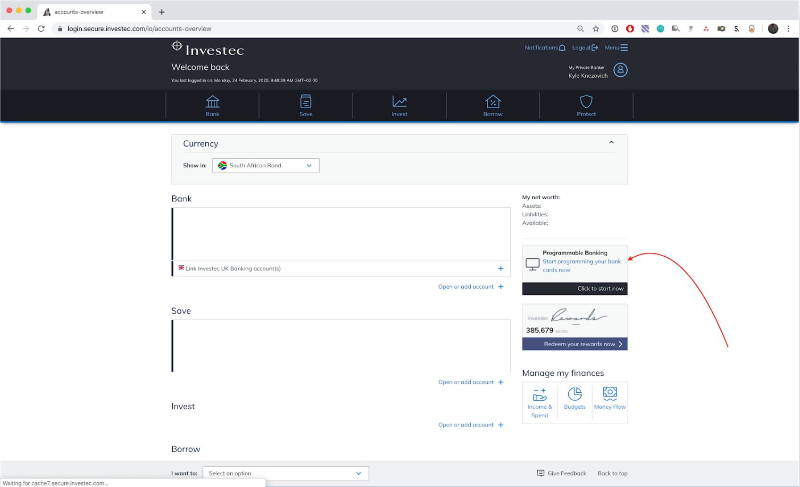
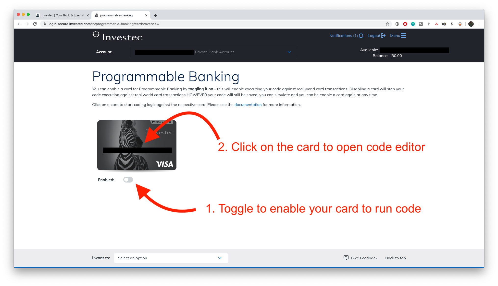
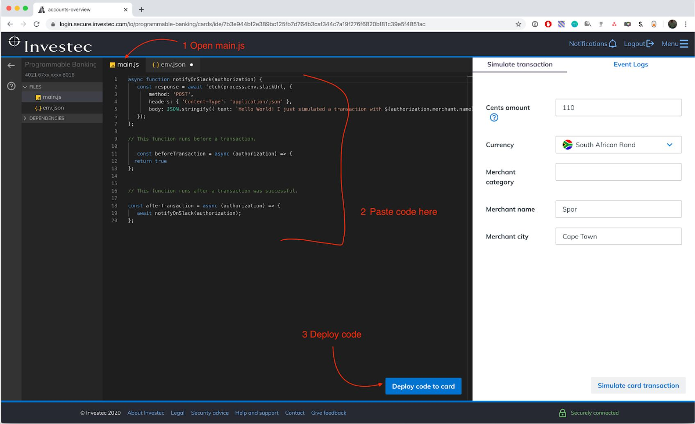
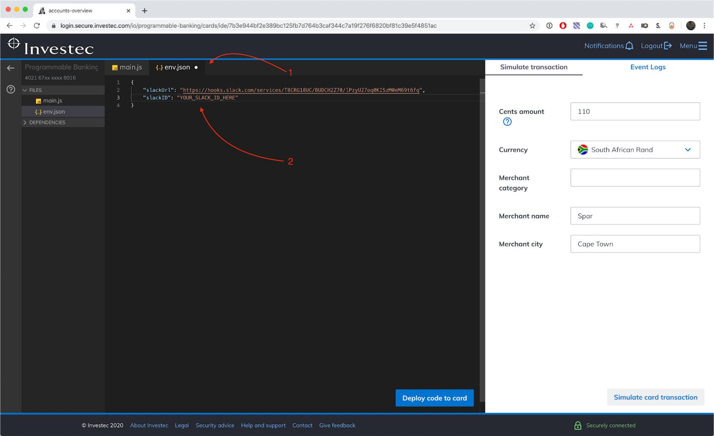
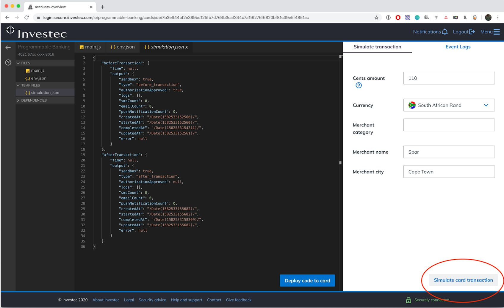

# 🛠 Build something simple

## Purpose of this tutorial

This tutorial is meant to help you achieve **2 things as quickly as possible** so that you can grasp the absolute basics of Investec’s Programmable Banking feature:

1. Join OfferZen Community [Slack](https://offerzen-community.slack.com/archives/CUBJ511K8) so that you can send a message to an external system
2. Send a message to Slack from Investec Programmable Banking when you simulate a transaction to get a feel for how it works

## The challenge

### Step 1: Join [`#rooty`](https://offerzen-community.slack.com/archives/CTZMZM2H1) on OfferZen Community Slack

### Step 2: Open Investec Programmable Banking

Log in to your online banking and select the programmable banking option.

### Step 3: Select the card you want to code

> ProTip: You can enable and disable the code on each card using the toggle below the cards.

* You can also use the mobile app to do that by tapping on your account, then on cards, and there you will see a toggle for programmable banking.
* 💡 Often people forget they added code that blocks transactions and their card is declined at the shops and they call the call centre - so if your card declines at the shop, remember that you can disable your code from the mobile app.&#x20;

### Step 4: Setup your `main.js` file

Replace all the code in your `main.js` file in the editor [with this code](https://gitlab.com/offerzen-community/investec-programmable-banking/programmable-card-starter-challenge/-/raw/master/main.js). Make sure you _Deploy code to card_ when you're done.

> ProTip: Transaction log history

* On the right-hand side near the top of the screen, you will see “Event logs”, you can click on that to get a history of transactions that you made with code enabled and the logs of those transactions - you can click on it to see this.
* You will notice you have simulator logs and production logs.
* Simulation transactions are fake transactions like the one we just ran which you can use for testing.
* Production transactions are the real transactions you make when you use your card.

### Step 5: Setup your `env.json` file and add your Slack ID

Get your Slack ID from OfferZen Community Slack:

Now replace all the code in your `env.json` file [with this code](https://gitlab.com/offerzen-community/investec-programmable-banking/programmable-card-starter-challenge/-/raw/master/env.json) in the editor, and replace `YOUR_SLACK_ID_HERE` with **your actual Slack ID**. Deploy your code to card when you're done:

### Step 6: Simulate a transaction in the programmable banking app!

### Step 7: Celebrate when you see your notification on OfferZen Community Slack \o/

### <mark style="color:red;">**NB**</mark> Step 8: Delete/edit your code

This code is now live on your card. Please make sure you clear it out or delete it to ensure that your live transactions aren't posted into `#rooty`
