# Blog posts


​​If you have anything to share with the community, articles, code, advice, etc. Please feel free to email us at [community-investec@offerzen.com](mailto:community-investec@offerzen.com) 🙌.


<table data-header-hidden><thead><tr><th width="236"></th><th width="335"></th><th data-type="select" data-multiple></th></tr></thead><tbody><tr><td><a href="https://www.offerzen.com/blog/programmable-banking-is-making-bill-splitting-easy">How Programmable Banking is making bill splitting easy</a></td><td></td><td></td></tr><tr><td><a href="https://www.offerzen.com/blog/learnings-from-banking-api">Learnings from working with Banking APIs</a></td><td></td><td></td></tr><tr><td><a href="https://www.offerzen.com/blog/programmable-banking-single-source-financial-truth">Building a Single Source of Financial Truth</a></td><td></td><td></td></tr><tr><td><a href="https://www.offerzen.com/blog/programmable-banking-how-categorise-transactions-using-ai">How to Categorise Your Bank Transactions Using AI</a></td><td>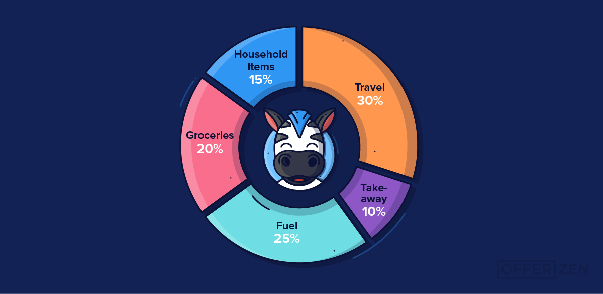</td><td></td></tr><tr><td><a href="https://www.offerzen.com/blog/programmable-banking-running-a-remote-hackathon">8 simple steps to running a remote hackathon</a></td><td>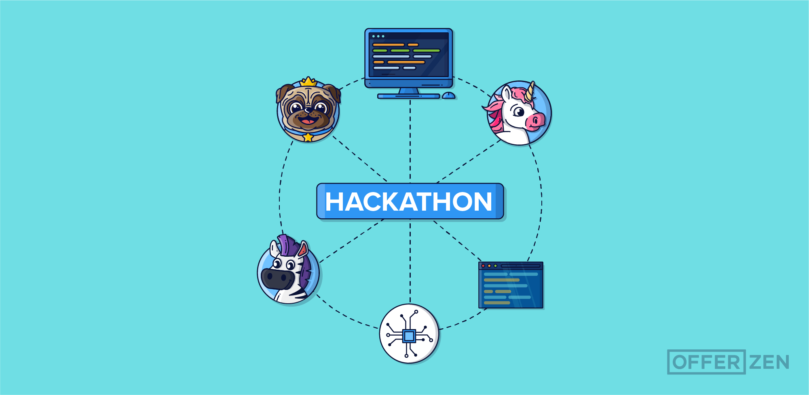</td><td></td></tr><tr><td><a href="https://www.offerzen.com/blog/programmable-banking-how-to-build-a-budget-tracking-app">How to build a low-code budget tracking app</a></td><td></td><td></td></tr><tr><td><a href="https://www.offerzen.com/blog/programmable-banking-telegram-banker">Your Own Telegram Banker: A low-code solution enabling easy access to banking data</a></td><td>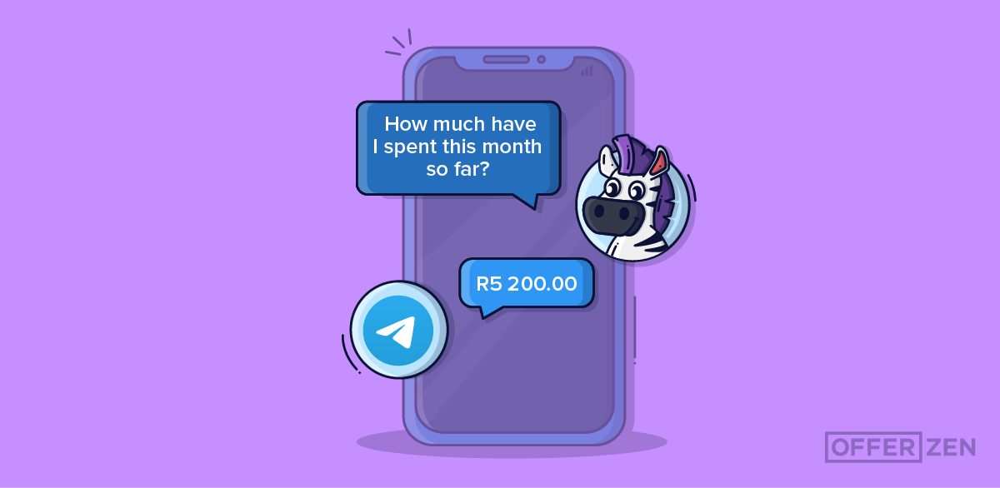</td><td></td></tr><tr><td><a href="https://www.offerzen.com/blog/how-platform45-automated-expense-reconciliation">Platform45: Automating corporate expense reconcillation </a></td><td>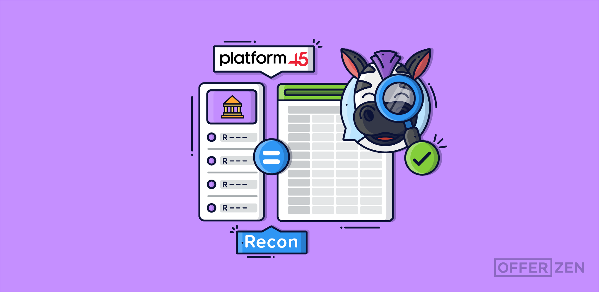</td><td></td></tr><tr><td><a href="https://www.offerzen.com/blog/programmable-banking-how-to-build-a-budget-tracking-app">Banking with building blocks</a></td><td></td><td></td></tr><tr><td><a href="https://www.offerzen.com/blog/app-helps-save-money-while-exercising">Run to the Bills: The App that helps you to save money while you exercise</a></td><td></td><td></td></tr><tr><td><a href="https://www.offerzen.com/blog/principles-for-no-code-low-code-solution-builds">Principles for low-code solution builds</a></td><td></td><td></td></tr><tr><td><a href="https://www.offerzen.com/blog/buying-electricity-with-bitcoin-the-lightningwatts-proof-of-concept">Buying Electricity with Bitcoin: The “LightningWatts” Proof of Concept</a></td><td>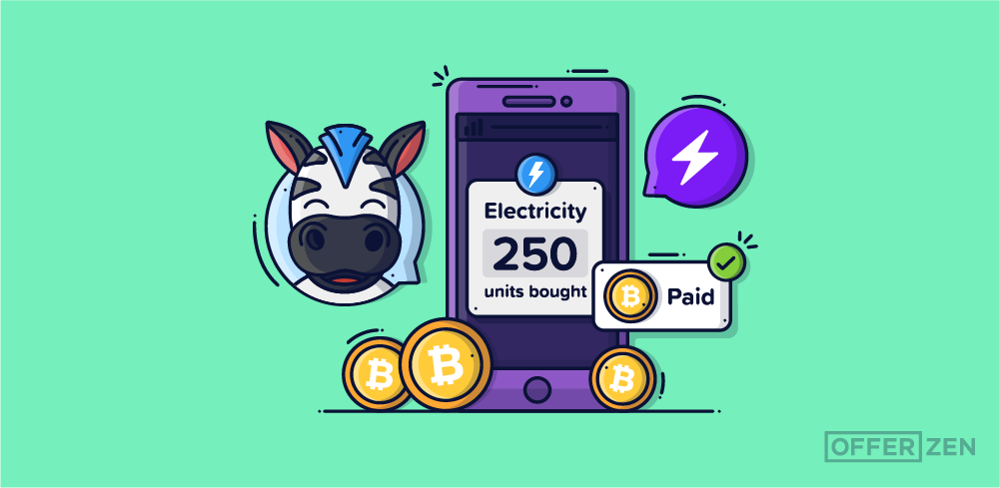</td><td></td></tr><tr><td><a href="https://www.offerzen.com/blog/how-programmable-banking-connects-siri-and-account-transfers">How Programmable Banking Connects Siri and Account Transfers</a></td><td>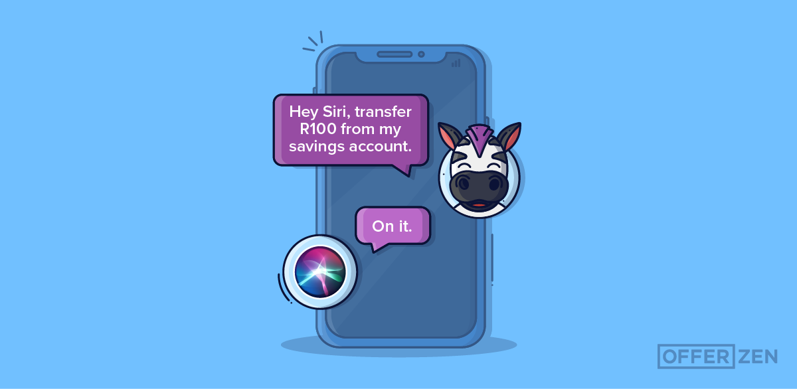</td><td></td></tr><tr><td><a href="https://www.offerzen.com/blog/how-we-created-a-proof-of-concept-in-a-day">How we created a proof of concept in a day (Spreadsheet Banking)</a></td><td></td><td></td></tr><tr><td><a href="https://www.offerzen.com/blog/programmable-banking-community-how-to-save-on-your-mortgage-interest">How to save on your mortgage interest</a></td><td></td><td></td></tr><tr><td><a href="https://www.offerzen.com/blog/programmable-banking-community-a-simpler-way-to-plan-manage-your-businesses-taxes">A simpler way to plan and manage your business taxes</a></td><td></td><td></td></tr><tr><td><a href="https://www.offerzen.com/blog/programmable-banking-community-how-to-save-on-interest-when-paying-off-debt">How To Save On Interest When Paying Off Debt</a></td><td>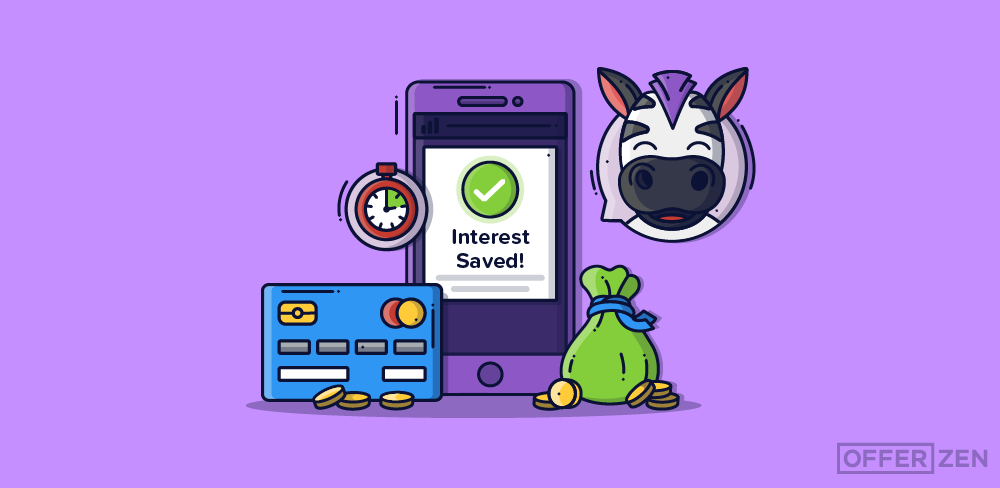</td><td></td></tr><tr><td><a href="https://www.offerzen.com/blog/programmable-banking-community-how-to-easily-automate-analyse-your-personal-finances">How To Easily Automate &#x26; Analyse Your Personal Finances</a></td><td></td><td></td></tr><tr><td><a href="https://www.offerzen.com/blog/onecart-using-programmable-banking-for-fraud-detection-and-prevention">OneCart: Using Programmable Banking for Fraud Detection and Prevention</a></td><td></td><td></td></tr><tr><td><a href="https://www.offerzen.com/blog/programmable-banking-community-offerzens-team-spending-finance-app">Tracking Team Card Spend Using Investec Programmable Banking at OfferZen</a></td><td>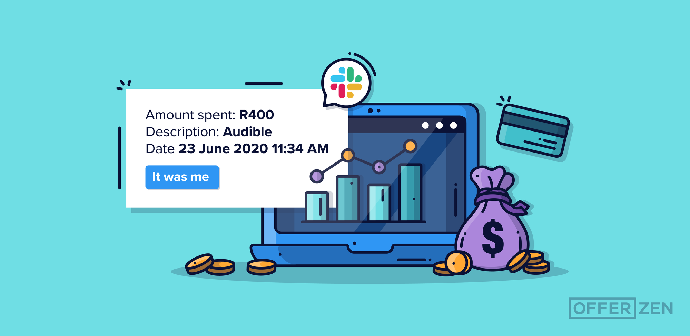</td><td></td></tr><tr><td><a href="https://www.offerzen.com/blog/how-make-events-help-us-have-meaningful-community-interactions-remotely">How Make Events Help Us Have Meaningful Community Interactions Remotely</a></td><td></td><td></td></tr><tr><td><a href="https://www.offerzen.com/blog/programmable-banking-community-a-slack-app-for-better-spending-habits">A Slack App for Better Spending Habits</a></td><td></td><td></td></tr><tr><td><a href="https://www.offerzen.com/blog/building-a-programmable-bank-account-for-developers-part-2">Building a Programmable Bank Account for Developers (Part 2)</a></td><td></td><td></td></tr><tr><td><a href="https://www.offerzen.com/blog/programmable-banking-community-employee-card-and-spend-management-system">Employee Card and Spend Management System</a></td><td></td><td></td></tr><tr><td><a href="https://www.offerzen.com/blog/programmable-banking-community-card-transaction-management-system">Card Transaction Management System</a></td><td></td><td></td></tr><tr><td><a href="https://www.offerzen.com/blog/programmable-banking-community-wealth-projection-platform">Wealth Projection Platform</a></td><td></td><td></td></tr><tr><td><a href="https://www.offerzen.com/blog/programmable-banking-community-building-better-financial-awareness">Building Better Financial Awareness</a></td><td></td><td></td></tr><tr><td><a href="https://www.offerzen.com/blog/how-african-alliance-automated-expense-allocation-to-save-time-and-costs">How African Alliance Automated Expense Allocation to Save Time and Costs</a></td><td></td><td></td></tr><tr><td><a href="https://www.offerzen.com/blog/programmable-banking-community-mak-rewarding-employees-easy-and-fun">Make Rewarding Employees Easy and Fun</a></td><td></td><td></td></tr><tr><td><a href="https://www.offerzen.com/blog/programmable-banking-community-an-easy-way-to-track-your-expiring-subscriptions">Don’t get Caught Out by Expiring Subscriptions</a></td><td>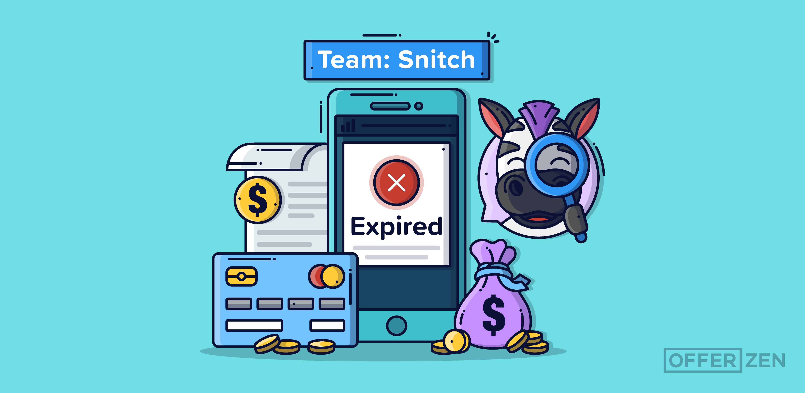</td><td></td></tr><tr><td><a href="https://www.offerzen.com/blog/programmable-banking-project-transparent-rewards-for-open-source-contributors">Transparent Rewards for Open Source Contributors</a></td><td></td><td></td></tr><tr><td><a href="https://www.offerzen.com/blog/making-programmable-banking-easier-for-everyone">Making Programmable Banking Easier for Everyone</a></td><td></td><td></td></tr><tr><td><a href="https://www.offerzen.com/blog/luno-co-founder-carel-van-wyk-on-leveling-up-with-projects">Luno Co-founder Carel van Wyk on Levelling Up with Projects</a></td><td></td><td></td></tr><tr><td><a href="https://www.offerzen.com/blog/programmable-banking-community-banking-on-spreadsheets">Banking on Spreadsheet</a></td><td>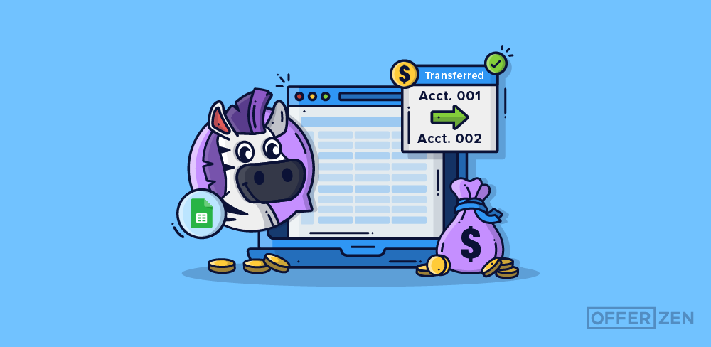</td><td></td></tr><tr><td><a href="https://www.offerzen.com/blog/how-senior-developer-renaldo-meere-learns-by-trial-and-error">How Senior Developer Renaldo Meere Learns by Trial and Error</a></td><td></td><td></td></tr><tr><td>“<a href="https://www.offerzen.com/blog/merge-panel-discussion-how-africas-tech-ecosystem-can-contribute-globally">How Africa’s Tech Ecosystem can Contribute Globally</a></td><td></td><td></td></tr><tr><td><a href="https://www.offerzen.com/blog/merge-presentation-wayne-summers-on-opening-up-financial-services-to-grow-the-sa-tech-ecosystem">Opening Up Financial Services to Grow the SA Tech Ecosystem</a></td><td></td><td></td></tr><tr><td><a href="https://www.offerzen.com/blog/malan-joubert-talking-fintech-robots-and-economics">Talking about FinTech, Robots and Economics in the New Norma</a></td><td></td><td></td></tr><tr><td><a href="https://www.offerzen.com/blog/expanding-fintech-ecosystem-with-paystack-community">Expanding the FinTech Ecosystem by Enabling the Paystack Community</a></td><td></td><td></td></tr><tr><td><a href="https://www.offerzen.com/blog/malini-selective-learning-levelling-up">“Selective Learning”: How to Turn Your Levelling up into a Daily Practice</a></td><td></td><td></td></tr><tr><td><a href="https://www.offerzen.com/blog/4-tips-maintaining-human-connection-remote-hiring">4 Tips for Maintaining Human Connection in Remote Hiring</a></td><td></td><td></td></tr><tr><td><a href="https://www.offerzen.com/blog/how-investec-is-helping-expand-the-international-future-of-fintech">How Investec is Helping Expand the International Future of FinTech</a></td><td></td><td></td></tr><tr><td><a href="https://www.offerzen.com/blog/how-cowrywise-is-empowering-the-african-community-to-save-and-invest">How Cowrywise is Empowering Expand the African Community to Save and Invest</a></td><td></td><td></td></tr><tr><td><a href="https://www.offerzen.com/blog/programmable-banking-update-dev-community-projects-openapi">Programmable Banking: Update on Dev Community Projects and the New OpenAPI Build</a></td><td></td><td></td></tr><tr><td><a href="https://www.offerzen.com/blog/open-banking-a-deep-dive-with-willem-fisser-investec">Open Banking: A Deep Dive with Willem Fisser</a></td><td></td><td></td></tr><tr><td><a href="https://www.offerzen.com/blog/louw-hopely-root-innovating-the-sa-insurance-sector-during-covid-19">Innovating the SA Insurance Sector During COVID-19</a></td><td></td><td></td></tr><tr><td><a href="https://www.offerzen.com/blog/programmable-banking-community-donovans-vanilla-transactions-dashboard">Donovan’s Vanilla Transactions Dashboard</a></td><td></td><td></td></tr><tr><td><a href="https://www.offerzen.com/blog/programmable-banking-community-adams-programmable-card-command-bridge">Adam’s Programmable Card Command Bridge</a></td><td></td><td></td></tr><tr><td><a href="https://www.offerzen.com/blog/programmable-banking-community-barrys-openapi-javascript-wrapper-with-typescript-definitions">Barry’s OpenAPI JavaScript Wrapper</a></td><td></td><td></td></tr><tr><td><a href="https://www.offerzen.com/blog/programmable-banking-community-pivendrens-money-report">Pivendren’s Money Report</a></td><td></td><td></td></tr><tr><td><a href="https://www.offerzen.com/blog/programmable-banking-community-jethros-shared-expenses-app">Jethro’s Shared Expenses App</a></td><td></td><td></td></tr><tr><td><a href="https://www.offerzen.com/blog/programmable-banking-community-rendanis-personal-budget-app">Rendani’s Personal Budget App</a></td><td></td><td></td></tr><tr><td><a href="https://www.offerzen.com/blog/programmable-banking-community-ross-openapi-python-cli">Ross’ OpenAPI Python CLI</a></td><td></td><td></td></tr><tr><td><a href="https://www.offerzen.com/blog/programmable-banking-community-vincents-java-and-python-wrappers">Vincent’s Java and Python Wrappers</a></td><td></td><td></td></tr><tr><td><a href="https://www.offerzen.com/blog/programmable-banking-community-christos-crypto-hedge">Christo’s Crypto Hedge</a></td><td></td><td></td></tr><tr><td><a href="https://www.offerzen.com/blog/programmable-banking-community-investec-team-product-update">Investec Team Product Update</a></td><td></td><td></td></tr><tr><td><a href="https://www.offerzen.com/blog/programmable-banking-community-loics-receipt-capture-app">Loic’s Receipt Capture App</a></td><td></td><td></td></tr><tr><td><a href="https://www.offerzen.com/blog/programmable-banking-community-renens-transaction-notifications">Renen's Transaction Notifications</a></td><td>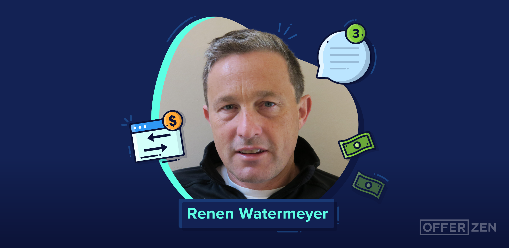</td><td></td></tr><tr><td><a href="https://www.offerzen.com/blog/programmable-banking-community-lionels-transactional-insights#sts=Programmable%20Banking%20Community:%20Lionel&#x27;s%20Transactional%20Insights">Lionel's Transactional Insights</a></td><td></td><td></td></tr><tr><td><a href="https://www.offerzen.com/blog/programmable-banking-community-michaels-client-creator">Michael’s Client Creator</a></td><td></td><td></td></tr><tr><td><a href="https://www.offerzen.com/blog/programmable-banking-community-lishens-temporary-store-of-value">Lishen's Temporary Store of Value</a></td><td></td><td></td></tr><tr><td><a href="https://www.offerzen.com/blog/programmable-banking-community-adrians-open-banking-cli">Adrian's Open Banking CLI</a></td><td></td><td></td></tr><tr><td><a href="https://www.offerzen.com/blog/programmable-banking-community-jorgs-smart-home-device-extension">Jorg's Smart Home Device Extension</a></td><td></td><td></td></tr><tr><td><a href="https://www.offerzen.com/blog/programmable-banking-community-marcins-graphql-wrapper-for-the-openapi">Marcin's GraphQL Wrapper for the Open API</a></td><td></td><td></td></tr><tr><td><a href="https://www.offerzen.com/blog/syncing-transactions-into-sage-one-with-investec-programmable-banking">Syncing Transactions Into Sage One With Investec Programmable Banking</a></td><td></td><td></td></tr></tbody></table>




