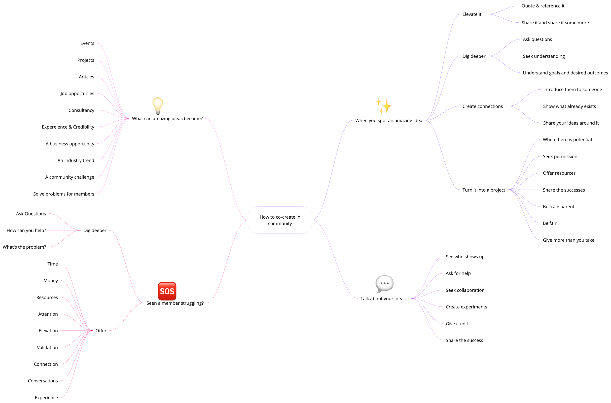

# Get Involved

## How do I get started with community?&#x20;

* [ ] Join the community by signing up [**here**](https://8malmkzgvs8.typeform.com/to/VlKgTtaV?typeform-source=app.gitbook.com) :writing\_hand:
* [ ] Once you've filled in the form, we'll send you an invitation to join the [**Slack Community** ](https://docs.google.com/presentation/d/1tKT\_PaDPP4IthYlJFhQ\_y0DnGS6I\_fCjkv\_yr\_rL2YE/present?slide=id.g889d757864\_0\_96)
* [ ] Book a welcome call with our Community Lead, Nick Benson, [**here**](https://calendly.com/nick-offerzen/community-welcome-chat?month=2023-06) :telephone:

## How do I participate in the community?

There are plenty of ways to be active in the community. If you're new to community, or are starting to get back into things, there is something for everyone.&#x20;

<table data-header-hidden data-full-width="false"><thead><tr><th width="304"></th><th></th></tr></thead><tbody><tr><td>#️ Join Slack </td><td>Sign up<a href="https://8malmkzgvs8.typeform.com/to/VlKgTtaV?typeform-source=app.gitbook.com"> <strong>here</strong></a>, and then look out for an email invite to Slack.</td></tr><tr><td>⌨ Start a Slack conversation</td><td>
<strong>#02_pb-general :</strong> General chat for Programmable Banking  <strong>#04_pb-make-it-happen:</strong> Let us know what you're making/building 

<strong>#01_pb-howzit:</strong> Say hi!
</td></tr><tr><td>🍕Attend a meetup</td><td>Check out upcoming events <a href="https://lu.ma/pb-community"><strong>here</strong></a><strong>.</strong></td></tr><tr><td>🎙Demo at a meetup </td><td>Get in touch with us (<a href="mailto:community-investec@offerzen.com">community-investec@offerzen.com</a>) about demoing your project.</td></tr><tr><td>🛠Sign up for a build challenge</td><td>Take a look at our open build challenges <a href="../get-building/build-events/"><strong>here</strong></a>.</td></tr><tr><td>💻 Build and share an open source project/library  </td><td>View all the amazing community projects <a href="https://gitlab.com/offerzen-community/investec-programmable-banking/command-center#open-source-projects"><strong>here</strong></a> for inspiration.</td></tr><tr><td>🙋Give product feedback</td><td>Upvote or log new feature requests <a href="https://programmable-banking-community.canny.io/"><strong>here</strong></a><strong>.</strong> These are reviewed weekly by the Investec API team. </td></tr><tr><td>🎟Open a support ticket</td><td>Log a support ticket <a href="https://gitlab.com/offerzen-community/investec-programmable-banking/issues-and-ideas"><strong>here</strong></a><strong>.</strong></td></tr><tr><td>🏃♂Send more than 1000 API calls</td><td>Get started on the API <a href="../get-started/api-quick-start-guide/"><strong>here</strong></a>. </td></tr><tr><td>📩 Read the newsletter</td><td>Get monthly updates on whats happening in the community.</td></tr><tr><td>📜Write a blog article with us</td><td>Blog articles about the cool solutions developers are building with Programmable Banking are listed <a href="blog-posts.md"><strong>here</strong></a><strong>.</strong> </td></tr><tr><td>💬 Share a post on LinkedIn or Twitter </td><td>Help us spread the word about Programmable Banking. </td></tr></tbody></table>

## Becoming a community champ&#x20;

We run a [**community champions program**](https://offerzen-community.slack.com/archives/C0422M2NUEB), where our most engaged community members are recognised and rewarded for their efforts in supporting and contributing to the community.&#x20;

Our community champs enable and support others to grow and learn and are an integral part of the community.&#x20;

👉 You can request to join the Champs program or nominate a fellow community member [**here**](https://8malmkzgvs8.typeform.com/to/ByOYqQhh).

## What's the swag like?

Check out a few things we give to awesome community members who live [**our core principles and values**](community-manifesto.md#core-principles-and-values)**.** 👇

## How to think about co-creation in community&#x20;

<figure><figcaption>
How to co-create in the community
</figcaption></figure>


If you have an idea or want to find out how to get more involved in the community, reach out to us at [community-investec@offerzen.com](mailto:community-investec@offerzen.com) or schedule 15 minutes to chat [here](https://calendly.com/nick-offerzen/community-welcome-chat?month=2023-06).

