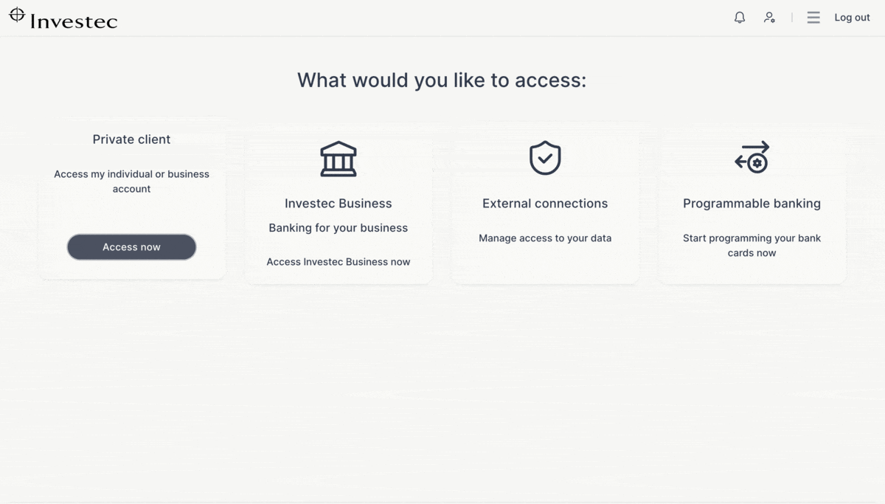
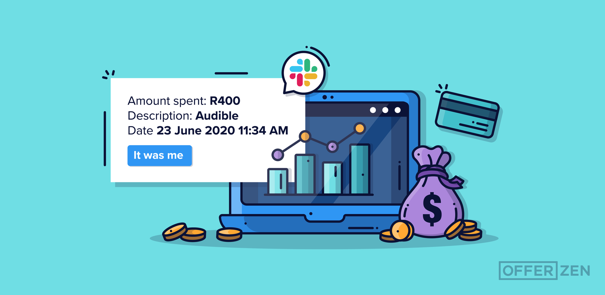

# API Quick Start Guide

📖 This API Quick Start Guide provide a step-by-step for getting started on the Investec Programmable Banking API and covers:

* How to get your API keys.
* How to test if your API keys are working.
* How to programmatically retrieve information from an Investec account.
* How to programmatically initiate banking transactions.

There is a community-contributed [**Postman Collection**](https://www.postman.com/investec-open-api/workspace/programmable-banking/overview) that we recommend you fork as you follow along in the guide. Let’s get started!

<details>

<summary>🔑 How to get your API keys</summary>

To start using the Investec API, you must first obtain credentials for programmatic access. These are used to authenticate your requests so you can transact securely against an Investec Private Bank Account.

**Pro Tip:** If you do not have an Investec Private Bank Account, you can easily sign up online on the [Investec website.](https://www.investec.com/en\_za/banking/tech-professionals/programmable-banking.html)

If you already have an Investec Private Bank Account, you must enroll your account for Programmable Banking functionality. Contact your Private Banker and request activation for Programmable Banking.&#x20;

Now that you have an Investec Private Bank Account with Programmable Banking enabled, you can retrieve your API credentials online.

You can find them in the _Tools -> Individuals Connections_ section of your Private Client banking:



You will also want to create an API key. Click the _Create new API key_ button and follow the instructions.

</details>

<details>

<summary>👤 How to authenticate </summary>

Before you query the Investec API for an account’s history, you must first authenticate. This is how the Investec API safeguards your account.

You must first retrieve a secure access token, formally called a bearer token, to be used in all outbound API calls.

To get a bearer token:

* Send an API request to the https://openapi.investec.com/identity/v2/oauth2/token endpoint.&#x20;
* The endpoint receives your client ID and client secret as [BASIC](https://en.wikipedia.org/wiki/BASIC) authentication headers. Additionally, you must send your API key in an x-api-key header.
* The request body must have a field grant\_type with value client\_credentials.
* It will return a bearer token that you can use in all subsequent API requests. The token is valid for 30 minutes, and you can always request a new one.

The Postman collection comes with an "Authentication -> 200 - OK" request that you can can run with your account credentials to try this out for yourself. 🎉\


You will want to set your credentials as variables in the collection for ease of reuse. The collection comes with client\_id, client\_secret and api\_key variables. You'll find the Variables tab after selecting the Edit menu.



If your keys are valid, the response will contain the token and an expiration when you send the request.

Here’s an example response:&#x20;

```json
{
  "access token": "qwertyuiop123456789",
  "token_type": "Bearer",
  "expires_in": "1799",
  "scope": "accounts",
 }
```

</details>

<details>

<summary>🏦  How to get your transaction history </summary>

The Investec API enables you to query several details about an account. First, we’ll explore how to retrieve an account’s transaction history.

The API endpoint returns a list of transactions between two dates, as specified in your request.

Every account on your bank account has a unique ID that you use when transacting against it. So first, you must obtain the appropriate ID. Fortunately, the Investec API has an easy-to-use endpoint for this.

Make an API call to https://openapi.investec.com/za/pb/v1/accounts. It does not take any special parameters and returns a JSON list of all your accounts and their IDs.

Run the Get Accounts request in the [Postman collection](https://www.postman.com/investec-open-api/workspace/programmable-banking/request/26868804-37aea713-c406-450b-a3e3-adca642caa6c), and remember to add the bearer token obtained earlier on as variable in your Postman environment.

Below is an example response. You want the value in the “accountId” field.

```json
{
  "data": {
    "accounts": [
      {
        "accountId": "1234567890",
        "accountNumber": "11223344556677",
        "accountName": "Jane Smith",
        "referenceName": "Jane Smith",
        "productName": "Private Bank Account",
        "kycCompliant": true,
        "profileId": "9876543210"
      },
    ]
  },
  "links": {
    "self": "https://openapi.investec.com/za/pb/v1/accounts"
  },
  "meta": {
    "totalPages": 1
  }
}
```

A typical request to retrieve transactions will take the form:

http://api.investec.com/za/bb/v1/accounts/{accountId}/transactions?fromDate={fromDate}\&toDate={toDate}\&page=1.

Where {accountId} is the account ID you have just obtained, whereas fromDate and toDate can be any [ISO 8601](https://en.wikipedia.org/wiki/ISO\_8601) formatted date \[Example of formatted date: 1999-09-09]].

Let’s get transactions from the last month. Our request would be: http://api.investec.com/za/bb/v1/accounts/1234-5678/transactions?fromDate=2023-02-22\&toDate=2023-01-22\&page=1.

You can add these parameters to the _Get Account Transactions_ Postman request, taking care to use the correct account ID.

Pro Tip: As you may have noticed, the endpoint accepts a pagination parameter for when you need to iterate through a longer transaction history.

If you have added the correct account ID, you will get a response with structure:

```json
{
  "data": {
    "transactions": [
      {
        "accountId": "1234567890",
        "type": "DEBIT",
        "transactionType": "OnlineBankingPayments",
        "status": "POSTED",
        "description": "LOREM IPSUM",
        "cardNumber": "",
        "postedOrder": 123,
        "postingDate": "2023-01-10",
        "valueDate": "2023-01-11",
        "actionDate": "2023-01-12",
        "transactionDate": "2023-01-10",
        "amount": 100,
        "runningBalance": 9999.99
      }
    ]
  },
  "links": {
    "self": "https://openapi.investec.com/za/pb/v1/accounts/1234567890/transactions?fromDate=2023-01-01&toDate=2023-01-31"
  },
  "meta": {
    "totalPages": 1
  }
}
```

That’s it!

Now you know how to pull data from the Investec API. You can discover several other endpoints in the [API reference](https://developer.investec.com/za/api-products), they all authenticate in the same fashion..

In the next step, we will explore how to push data to the Investec API and effect account changes.&#x20;

</details>

<details>

<summary>💸 How to make a beneficiary payment</summary>

In addition to retrieving historical data from your account, the Investec API allows you to programmatically make payments to beneficiaries on your account.

Let’s explore how to make a payment to an existing beneficiary on your account.

Please note that you can only make programmatic payments to beneficiaries that have been paid at least once before with regular online banking from your account.

As with accounts, every beneficiary on your banking profile also has a unique ID. You can retrieve the list of beneficiaries from the following endpoint: https://openapi.investec.com/za/pb/v1/accounts/beneficiaries. Again, you use a bearer token for authentication as with all API requests to the Investec API, and a typical response has the following structure:&#x20;

```json
{
  "data": [
    {
      "beneficiaryId": "LOREMIPSUMDOLOR=",
      "accountNumber": "1234567890",
      "code": "123456",
      "bank": "ACME CORP",
      "beneficiaryName": "Jane Smith",
      "lastPaymentAmount": "1.00",
      "lastPaymentDate": "10/01/2023",
      "cellNo": null,
      "emailAddress": null,
      "name": "Jane Smith",
      "referenceAccountNumber": "LOREM IPSUM DOLOR",
      "referenceName": "LOREM IPSUM",
      "categoryId": "112233445566",
      "profileId": "77889900"
    },
  ],
  "links": {
    "self": "https://openapi.investec.com/za/pb/v1/accounts/beneficiaries"
  },
  "meta": {
    "totalPages": 1
  }
}
```

The [Postman Collection](https://www.postman.com/investec-open-api/workspace/programmable-banking/request/26868804-1bc46536-5cf4-4c41-8fe7-0f77ce9f0d90) has a request for this named Beneficiaries (in the Beneficiaries folder)

Now that you have a beneficiary ID, let’s make a small payment to them. For that, we’ll be using https://openapi.investec.com/za/pb/v1/accounts/{accountId}/paymultiple.

The endpoint receives an array list of payments, as it’s able to process multiple payments at one point. Payments are easily defined and have four key fields:

```json
{
  "paymentsList": [
    {
      "beneficiaryId": "01234567890",
      "amount": "10",
      "myReference": "API transfer",
      "theirReference": "API transfer"
    }
  ]
}
```

The [Postman collection](https://www.postman.com/investec-open-api/workspace/programmable-banking/request/26868804-66e7b38a-86f7-49b2-9977-4b0ea2c696a6) has a Beneficiary Payment request you can use to try this out for yourself.

As you will see, you have full programmatic control of the process and it does not require additional manual verification.

</details>

**Congratulations on completing the quick start!** If you need any assistance, you are always welcome to reach out to the [Slack community](https://offerzen-community.slack.com/archives/C04KFQA3YCQ).


**Share a screenshot of your 200 with us** [**on Slack**](https://offerzen-community.slack.com/archives/C04KFQA3YCQ) **when you’re up and running!**


